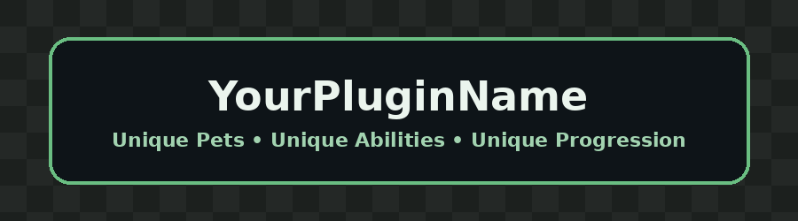

  

  <a href="README.md">English</a> |
  <a href="README.pt-BR.md"><strong>Português</strong></a>

# KidPets

KidPets é um plugin de Pets para Minecraft no qual cada Pet possui uma função, progressão e conjunto de habilidades únicos.

Os Pets não são apenas companheiros cosméticos. Cada um muda a forma como o jogador explora, sobrevive, coleta recursos ou luta.

> **Status do projeto:** Em desenvolvimento.

## Principais Recursos

- Cada Pet possui uma identidade única de gameplay
- Nenhuma habilidade é repetida entre Pets
- Progressão individual por Pet
- Evolução baseada nas ações realizadas
- Habilidades passivas, ativas e supremas
- Estrutura expansível de documentação e configuração
- Desenvolvido para servidores RPG, Survival e focados em progressão

## Estrutura de Habilidades

Todo Pet possui quatro qualidades:

1. **Passiva de Ação**  
   Ativada enquanto o jogador executa uma ação relacionada ao Pet.

2. **Passiva de Necessidade**  
   Ativada automaticamente quando o jogador precisa de auxílio.

3. **Habilidade Ativa**  
   Ativada manualmente pelo jogador.

4. **Super Habilidade**  
   Uma habilidade poderosa com recarga maior ou requisito de carregamento.

[Leia a documentação completa do Sistema de Pets](docs/pt-BR/sistema-de-pets.md)

## Pets Disponíveis

### Farejador

**Função:** Coleta, Natureza e Sobrevivência

**Resumo das Habilidades:**  
Auxilia o jogador na coleta de recursos naturais, obtenção de alimentos e controle da fome.

[Ver especificações completas do Farejador](docs/pt-BR/pets/farejador.md)

---

### Axolote

**Função:** Cura e Sobrevivência

**Resumo das Habilidades:**  
Auxilia o jogador com cura imediata, regeneração e recuperação em emergências.

[Ver especificações completas do Axolote](docs/pt-BR/pets/axolote.md)

---

### Morcego

**Função:** Mineração e Exploração de Cavernas

**Resumo das Habilidades:**  
Auxilia o jogador na exploração de locais escuros, localização de recursos e mineração.

[Ver especificações completas do Morcego](docs/pt-BR/pets/morcego.md)

## Documentação

- [Instalação](docs/pt-BR/instalacao.md)
- [Comandos](docs/pt-BR/comandos.md)
- [Permissões](docs/pt-BR/permissoes.md)
- [Configuração](docs/pt-BR/configuracao.md)
- [Sistema de Pets](docs/pt-BR/sistema-de-pets.md)

## Desenvolvimento Futuro

- Sistema de níveis e evolução
- Novos Pets únicos
- Melhorias de habilidades
- Carregamento das Super Habilidades
- Integrações adicionais com servidores
- Mais opções de configuração

## Contribuindo

Sugestões e relatos de problemas são bem-vindos. Ao contribuir, mantenha sincronizados os arquivos em inglês e português.

## Licença

Adicione a licença escolhida antes de publicar o repositório.
